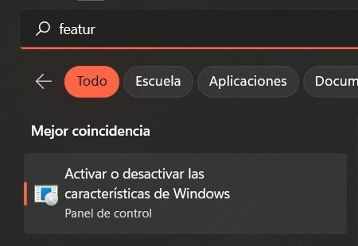
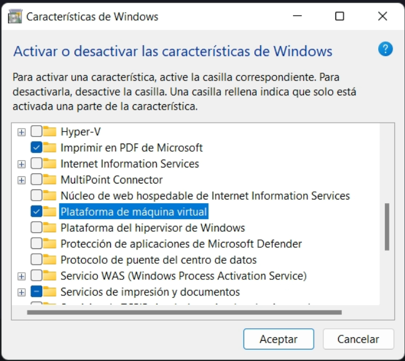
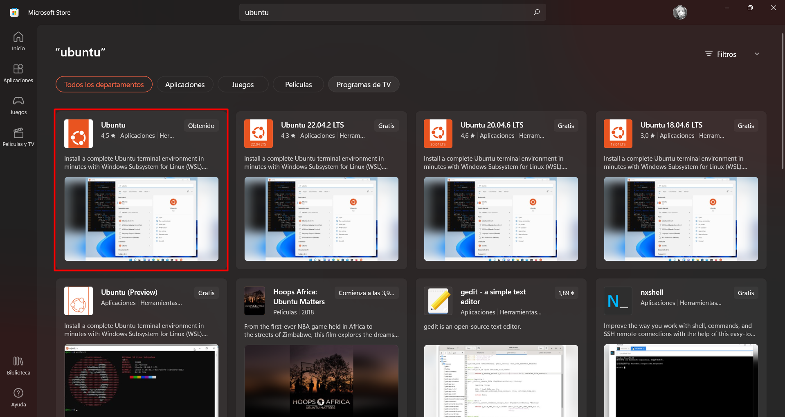
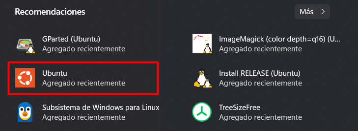
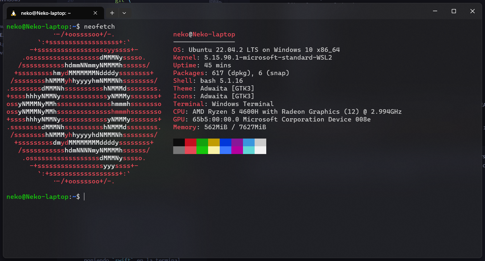
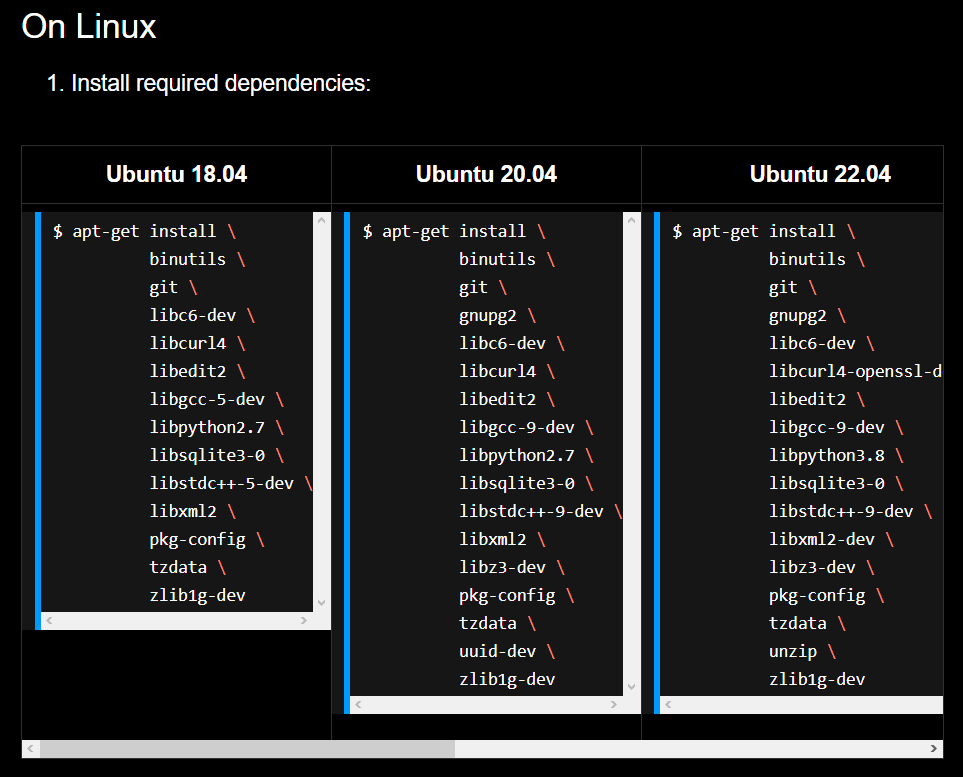
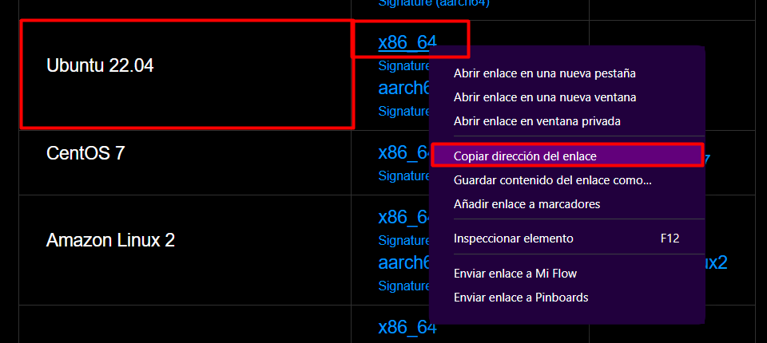
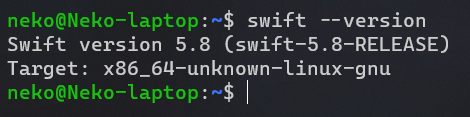
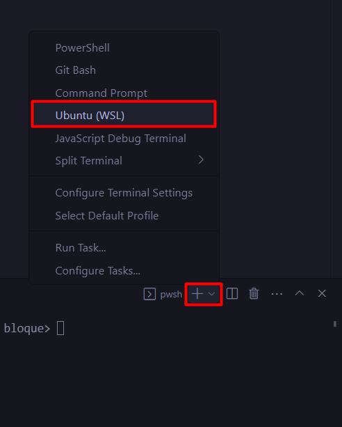

# Instalación de WSL en Windows
```PowerShell
wsl --install
```

Este comando habilitará las características necesarias para ejecutar WSL e instalará la distribución Ubuntu de Linux.

Es importante saber que para ejecutar este comando es necesario tener habilitada la [virtualización en la BIOS del equipo](https://youtu.be/zDKlht-4L2U) y que el equipo debe tener instalada la versión 1903 o superior de Windows 10.

**Aunque no suele ser necesario**, en algunos casos será necesario habilitar la característica de Windows Subsystem for Linux en Windows 10. Para ello debes abrir PowerShell como administrador y ejecutar el comando:
```powershell
dism.exe /online /enable-feature /featurename:Microsoft-Windows-Subsystem-Linux /all /norestart
```
 o buscar la característica en el panel de control de Windows y habilitarla desde ahí:




Para más información sobre la instalación de WSL puedes consultar la [documentación oficial](https://docs.microsoft.com/es-es/windows/wsl/install-win10).

# Instalar Ubuntu 22.04 LTS
En algunos casos este paso no es necesario porque el comando `wsl --install` a veces instala Ubuntu 22.04 LTS, pero en otros casos instala Ubuntu 20.04 LTS.

Para comprobar la versión de Ubuntu instalada puedes iniciar Ubuntu *(Vease el apartado siguiente)* y ejecutar el comando `lsb_release -a` en la terminal de Ubuntu. Si la versión es 20.04 LTS debes seguir los pasos de esta sección, si la versión es 22.04 LTS puedes saltarte esta sección.

Para instalar la versión es 22.04 LTS debes ir a la tienda de Microsoft y descargar Ubuntu 22.04 LTS, el comando `wsl --install` instala la versión 20.04 LTS, pero la versión 22.04 LTS es la última versión de Ubuntu y la que se recomienda para instalar Swift.
https://www.microsoft.com/store/productId/9PDXGNCFSCZV



# Iniciar Ubuntu
Tras la instalación es necesario reiniciar el equipo para aplicar actualizaciones, después de esto se puedes iniciar Ubuntu desde el menú de inicio de Windows.




# Instalar Swift en Ubuntu 22.04 LTS
Una vez iniciado Ubuntu se debe actualizar los paquetes:

```bash
sudo apt update
```

Instalar las dependencias de Swift:

```bash
sudo apt-get install \
          binutils \
          git \
          gnupg2 \
          libc6-dev \
          libcurl4-openssl-dev \
          libedit2 \
          libgcc-9-dev \
          libpython3.8 \
          libsqlite3-0 \
          libstdc++-9-dev \
          libxml2-dev \
          libz3-dev \
          pkg-config \
          tzdata \
          unzip \
          zlib1g-dev
```

Descargar y descomprimir Swift:
```bash
wget https://swift.org/builds/swift-5.8-release/ubuntu2204/swift-5.8-RELEASE/swift-5.8-RELEASE-ubuntu22.04.tar.gz
tar xzf swift-5.8-RELEASE-ubuntu22.04.tar.gz
```

Añadirlo al PATH y eliminar el comprimido antes descargado:
```bash
echo 'export PATH=$PATH:/<RUTE>/swift-5.8-RELEASE-ubuntu22.04/usr/bin' >> ~/.bashrc
rm swift-5.8-RELEASE-ubuntu22.04.tar.gz
```
* Donde pone `<RUTE>` debes poner la ruta donde se encuentra la carpeta `swift-5.8-RELEASE-ubuntu22.04` que se ha creado al descomprimir el archivo descargado. Por ejemplo, si la carpeta está en el directorio `home` y mi usuario es `user` la ruta sería:

    ```bash
    echo 'export PATH=$PATH:/home/user/swift-5.8-RELEASE-ubuntu22.04/usr/bin' >> ~/.bashrc
    ```

## En caso de tener otra versión de ubuntu
Las dependencias se pueden obtener de la página oficial de Swift: https://www.swift.org/getting-started/#installing-swift



El archivo se puede también de la página oficial de Swift: https://www.swift.org/download/#releases. El enlace copiado es el que va en el `wget` del script anterior.



Por último cambiar el nombre del archivo descargado en el `tar` del script anterior.

# Comprobar la instalación
*Antes de continuar cierra y abre la terminal de Ubuntu para actualizar el PATH.*

Para comprobar que la instalación se ha realizado correctamente debes ejecutar el comando `swift --version` en la terminal. Si todo ha ido bien debería aparecer la versión de Swift instalada.



# Usar Swift en Visual Studio Code
Puedes crear una carpeta donde desees en Windows, abrirla con Visual Studio Code y crear un archivo de prueba:

```swift
print("Hello, world!")
```

Para ejecutar el archivo debes abrir la terminal de Visual Studio Code y abrir la terminal de Ubuntu:



Hecho esto, puedes ejecutar el archivo con el comando `swift <NOMBRE_ARCHIVO>`. Por ejemplo, si el archivo se llama `main.swift` el comando sería `swift main.swift`:


